<div class="MCWHeader1">
Continuous delivery in Azure DevOps
</div>

<div class="MCWHeader2">
Hands-on lab step-by-step
</div>

<div class="MCWHeader3">
November 2021
</div>

Information in this document, including URL and other Internet website references, is subject to change without notice. Unless otherwise noted, the example companies, organizations, products, domain names, e-mail addresses, logos, people, places, and events depicted herein are fictitious, and no association with any real company, organization, product, domain name, e-mail address, logo, person, place or event is intended or should be inferred. Complying with all applicable copyright laws is the responsibility of the user. Without limiting the rights under copyright, no part of this document may be reproduced, stored in or introduced into a retrieval system, or transmitted in any form or by any means (electronic, mechanical, photocopying, recording, or otherwise), or for any purpose, without the express written permission of Microsoft Corporation.

Microsoft may have patents, patent applications, trademarks, copyrights, or other intellectual property rights covering subject matter in this document. Except as expressly provided in any written license agreement from Microsoft, the furnishing of this document does not give you any license to these patents, trademarks, copyrights, or other intellectual property.

The names of manufacturers, products, or URLs are provided for informational purposes only and Microsoft makes no representations and warranties, either expressed, implied, or statutory, regarding these manufacturers or the use of the products with any Microsoft technologies. The inclusion of a manufacturer or product does not imply endorsement of Microsoft of the manufacturer or product. Links may be provided to third-party sites. Such sites are not under the control of Microsoft and Microsoft is not responsible for the contents of any linked site or any link contained in a linked site, or any changes or updates to such sites. Microsoft is not responsible for webcasting or any other form of transmission received from any linked site. Microsoft is providing these links to you only as a convenience, and the inclusion of any link does not imply endorsement of Microsoft of the site or the products contained therein.

© 2022 Microsoft Corporation. All rights reserved.

Microsoft and the trademarks listed at <https://www.microsoft.com/en-us/legal/intellectualproperty/trademarks> are trademarks of the Microsoft group of companies. All other trademarks are property of their respective owners.

**Contents**

<!-- TOC -->

- [Continuous Delivery in Azure DevOps hands-on lab step-by-step](#continuous-delivery-in-azure-devops-hands-on-lab-step-by-step)
  - [Abstract and learning objectives](#abstract-and-learning-objectives)
  - [Overview](#overview)
  - [Solution architecture](#solution-architecture)
  - [Requirements](#requirements)
  - [Before the hands-on lab](#before-the-hands-on-lab)
  - [Exercise 1: Continuous Integration](#exercise-1-continuous-integration)
    - [Task 1: Set up Local Infrastructure](#task-1-set-up-local-infrastructure)
    - [Task 2: Build Automation with GitHub Registry](#task-2-build-automation-with-github-registry)
    - [Task 3: Editing the GitHub Workflow File Locally](#task-3-editing-the-github-workflow-file-locally)
    - [Task 4: Using Dependabot](#task-4-using-dependabot)
  - [Exercise 2: Continuous Delivery / Continuous Deployment](#exercise-2-continuous-delivery--continuous-deployment)
    - [Task 1: Set up Cloud Infrastructure](#task-1-set-up-cloud-infrastructure)
    - [Task 2: Deploy to Azure Web Application](#task-2-deploy-to-azure-web-application)
    - [Task 3: Continuous Deployment with GitHub Actions](#task-3-continuous-deployment-with-github-actions)
    - [Task 4: Branch Policies in GitHub (Optional)](#task-4-branch-policies-in-github-optional)
  - [Exercise 3: Monitoring, Logging, and Continuous Deployment with Azure](#exercise-3-monitoring-logging-and-continuous-deployment-with-azure)
    - [Task 1: Set up Application Insights](#task-1-set-up-application-insights)
    - [Task 2: Linking Git commits to Azure DevOps issues](#task-2-linking-git-commits-to-azure-devops-issues)
    - [Task 3: Continuous Deployment with Azure DevOps Pipelines](#task-3-continuous-deployment-with-azure-devops-pipelines)
  - [After the hands-on lab](#after-the-hands-on-lab)
    - [Task 1: Tear down Azure Resources](#task-1-tear-down-azure-resources)

<!-- /TOC -->

# Continuous Delivery in Azure DevOps hands-on lab step-by-step

## Abstract and learning objectives

In this hands-on lab, you will learn how to implement a solution with a combination of ARM templates and Azure DevOps to enable continuous delivery with several Azure PaaS services.

At the end of this workshop, you will be better able to implement solutions for continuous delivery with GitHub in Azure, as well create an ARM (ARM) template to provision Azure resources, create an Azure DevOps project with a GitHub repository, and configure continuous delivery with GitHub.

## Overview

Fabrikam Medical Conferences provide conference website services tailored to the medical community. Over ten years, they have built conference sites for a small conference organizer. Through word of mouth, Fabrikam Medical Conferences has become a well-known industry brand handling over 100 conferences per year and growing.

Websites for medical conferences are typically low-budget websites because the conferences usually have between 100 to 1500 attendees. At the same time, the conference owners have significant customization and change demands that require turnaround on a dime to the live sites. These changes can impact various aspects of the system from UI through to the back end, including conference registration and payment terms.

## Solution architecture

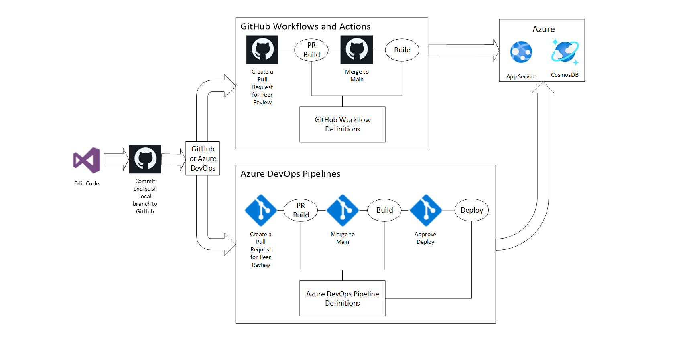

## Requirements

1. Microsoft Azure subscription must be pay-as-you-go or MSDN.
   - Trial subscriptions will _not_ work.
   - To complete this lab setup, ensure your account includes the following:
     - Has the [Owner](https://docs.microsoft.com/azure/role-based-access-control/built-in-roles#owner) built-in role for the subscription you use.
     - Is a [Member](https://docs.microsoft.com/azure/active-directory/fundamentals/users-default-permissions#member-and-guest-users) user in the Azure AD tenant you use. (Guest users will not have the necessary permissions.)

2. A [GitHub](https://github.com) account.

3. Local machine or a virtual machine configured with:

    - A browser, preferably Chrome, to be consistent with the lab implementation tests.

4. Git for Windows

5. PowerShell

    - As you will be running PowerShell scripts, make sure that the ExecutionPolicy is set properly. Consult [the Microsoft PowerShell documentation on execution policies](https://docs.microsoft.com/powershell/module/microsoft.powershell.core/about/about_execution_policies) for more details.

6. Docker Desktop for Windows

7. [Azure CLI](https://docs.microsoft.com/cli/azure/)

8. Angular - minimum 8.3.4.

    - Angular depends on Node.js and npm.
    - Consult [Setting up the local environment and workspace](https://angular.io/guide/setup-local) on the Angular site for guidance.
    - This lab has been tested with [Node.js](https://nodejs.org/en/download/) version 16.13.0, which includes npm 8.1.0.

## Before the hands-on lab

You should follow all steps in the [Before the hands-on lab setup guide](Before%20the%20HOL%20-%20Continuous%20delivery%20in%20Azure%20DevOps.md) *before* performing the Hands-on lab. Pay close attention to product versions, as the version numbers called out in the lab have been tested and shown successful for the lab.

## Exercise 1: Continuous Integration

Duration: 40 minutes

After a requirements gathering effort, we find that Fabrikam Medical Conferences has many areas of potential improvement in their development workflow. Specifically, we conclude that there are a lot of manual tasks that can be automated. Automation potentially mitigates many of the recurring quality and security issues. Also, the dependencies between Fabrikam's developers' work and productivity are reduced. We will begin to address some of these efforts in this exercise to improve developer flow and establish continuous integration practices.

**Help references**

|                                       |                                                                        |
| ------------------------------------- | ---------------------------------------------------------------------- |
| **Description**                       | **Link**                                                              |
| One Dev Minute - What is Continuous Integration? | <https://docs.microsoft.com/shows/one-dev-minute/what-is-continuous-integration--one-dev-question> |
| What is Continuous Integration? | <https://docs.microsoft.com/devops/develop/what-is-continuous-integration> |
| Microsoft Learn - Explore continuous integration | <https://docs.microsoft.com/learn/modules/explore-continuous-integration> |
| Microsoft Learn - Build continuous integration (CI) workflows by using GitHub Actions | <https://docs.microsoft.com/learn/modules/github-actions-ci/> |
| Microsoft Azure Well-Architected Framework - Release Engineering - Continuous Integration | <https://docs.microsoft.com/azure/architecture/framework/devops/release-engineering-ci> |

### Task 1: Set up Local Infrastructure

You are going to set up the local infrastructure using Docker containers. There are three images you will be working with:

- `fabrikam-init`
- `fabrikam-api`
- `fabrikam-web`

You will need to make some edits to files before running these locally. In this task, you will confirm that the Docker infrastructure works locally.

1. Open your local GitHub folder for your `mcw-continuous-delivery-lab-files` repository.

2. Replace instances of `<yourgithubaccount>` with your GitHub account name in the following files located in the root of your lab files repository.
    - `docker-compose.init.yml`
    - `docker-compose.yml`

   > **Note**: You should replace three instances of `<yourgithubaccount>` - one instance in `docker-compose.init.yml` and two instances in `docker-compose.yml`.

3. Build and run the docker-compose YAML files edited in the previous step.

    ```pwsh
    docker-compose -f .\docker-compose.yml -f .\local.docker-compose.yml -f .\docker-compose.init.yml build
    docker-compose -f .\docker-compose.yml -f .\local.docker-compose.yml -f .\docker-compose.init.yml up
    ```

4. Verify that you can browse to <http://localhost:3000> in a browser and arrive at the Fabrikam conference website.

    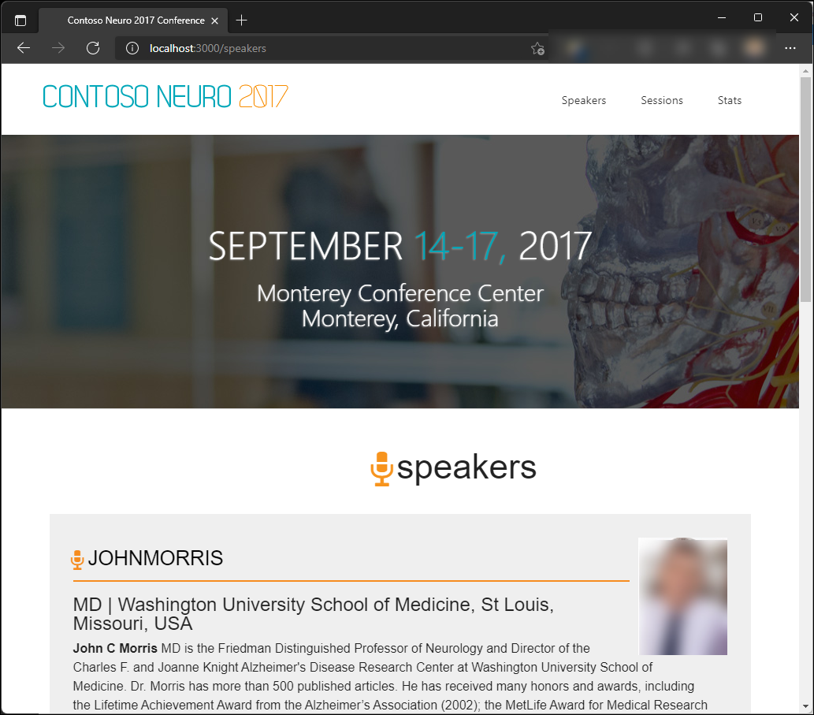

    

5. Commit and push your changes to your GitHub repository.

### Task 2: Build Automation with GitHub Registry

Now that we have Docker images working locally, we can build automation in GitHub for updating and republishing our Docker images when the code changes. In this task, we will create a workflow file using the GitHub interface and its GitHub Actions workflow editor. This will get you familiar with how to create and edit an action through the GitHub website.

1. In your GitHub lab files repository, select the `Settings` tab.

2. Select the `Secrets` blade from the left navigation bar.

    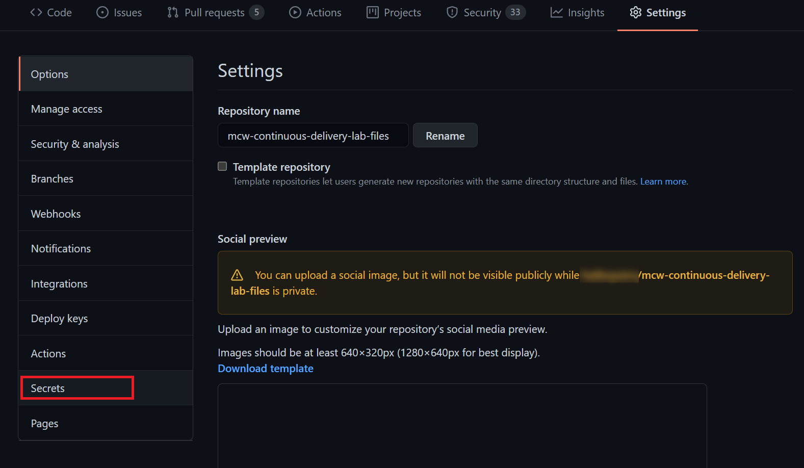

3. Select the `New repository secret` button.

    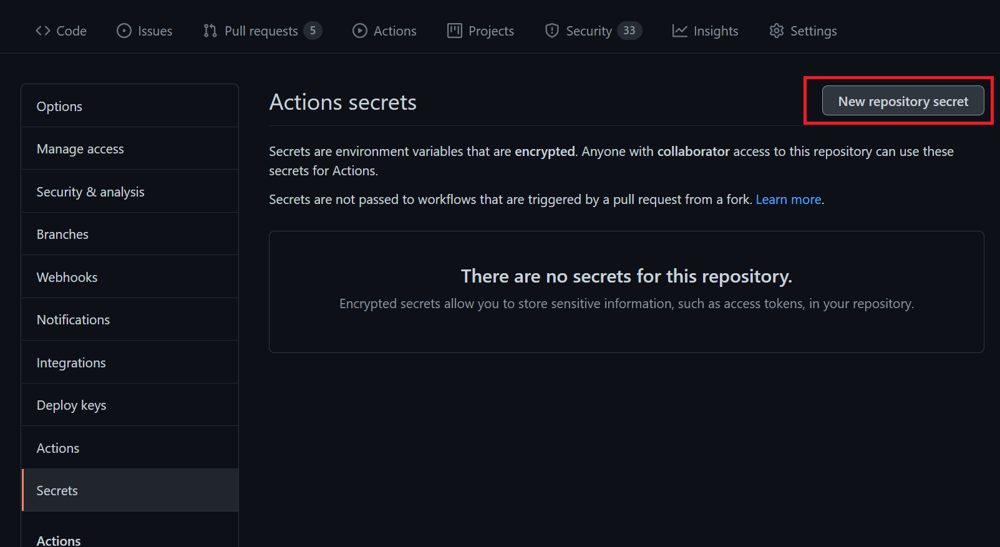

4. Enter the name `CR_PAT` in the `New secret` form and set the GitHub Personal Access Token we created in the Before the Hands-On Lab instructions.

    

    > **Note**: CR_PAT is short for Container Registry Personal Authentication Token.

5. Select the `Actions` tab in your GitHub repository, find the `Publish Docker Container` workflow and select `Configure`. This will create a file named `docker-publish.yml`.

    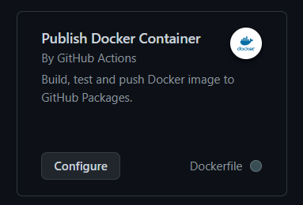

    > **Note**: If you have gone through this MCW in the past, note that this step has changed. Do not rename this file. Leave this file named `docker-publish.yml`.

6. Change the registry to `ghcr.io/${{ github.actor }}`. Replace the IMAGE_NAME line with `fabrikam-init`. The `env` section of this file should look like this YAML:

    ```yaml
        env:
        # Use docker.io for Docker Hub if empty.
        REGISTRY: ghcr.io/${{ github.actor }}
        # github.repository as <account>/<repo>
        IMAGE_NAME: fabrikam-init
    ```

7. The login step needs to be adjusted to use our `CR_PAT` secret value for the `password`. The login step should look like this:

    ```yaml
        # Login against a Docker registry except on PR
        # https://github.com/docker/login-action
        - name: Log into registry ${{ env.REGISTRY }}
            if: github.event_name != 'pull_request'
            uses: docker/login-action@28218f9b04b4f3f62068d7b6ce6ca5b26e35336c
            with:
            registry: ${{ env.REGISTRY }}
            username: ${{ github.actor }}
            password: ${{ secrets.CR_PAT }} # <-- Change this from GITHUB_TOKEN
    ```

8. Add explicit path to `Dockerfile` and context path to the `Build and push Docker image` step. This step will ensure the correct `Dockerfile` file can be found. The Build and push step should look like this:

    ```yaml
      # Build and push Docker image with Buildx (don't push on PR)
      # https://github.com/docker/build-push-action
      - name: Build and push Docker image for ${{ env.API_IMAGE_NAME }}
        id: build-and-push
        uses: docker/build-push-action@ad44023a93711e3deb337508980b4b5e9bcdc5dc
        with:
          file: ./content-init/Dockerfile                      
          context: ./content-init                              
          push: ${{ github.event_name != 'pull_request' }}
          tags: ${{ steps.meta.outputs.tags }}
          labels: ${{ steps.meta.outputs.labels }}
    ```

9. Commit the file to the repository. Select `Start commit`. Be sure that **Commit directly to the `main` branch** is selected. Finally, select `Commit new file`.

10. The GitHub Action is now running and will automatically build and push the container to GitHub registry.

    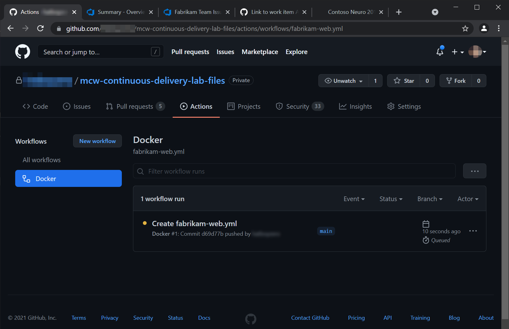

    

    > **Note**: If you encounter any errors due to `cosign`, remove the image signing section from the workflow, as it is not needed to complete the lab. You could alternatively add a manual trigger (see below) and try running the workflow again, to determine if the error is transient.

    > **Note**: You can optionally add `workflow_dispatch:` in the `on:` trigger section to set a manual trigger for the GitHub Actions workflow.

### Task 3: Editing the GitHub Workflow File Locally

The last task automated building and updating only one of the Docker images. In this task, we will update the workflow file with a more appropriate workflow for the structure of our repository. This task will end with a file named `docker-publish.yml` that will rebuild and publish Docker images as their respective code is updated.

1. Pull the changes from your repository to your copy of the code.

2. Copy `docker-publish.yml` from the `Hands-on lab\lab-files` folder to the `.github\workflows` folder, overwriting what you created in steps 1-5.

    - This file builds the following workflow:
  
    - The `check_changed_folders` job takes the following steps:

      1. Look through all files in the `git diff`.
      2. If there are files changed in `content-api`, set a flag to update the API Docker Image.
      3. If there are files changed in `content-web`, set a flag to update the Web Docker Image.
      4. If there are files changed in `content-init`, set a flag to update the Init Docker Image.
  
    - Each of the `build-` jobs are marked with `needs` to depend on the `git diff` check. The `if` indicates the condition that will trigger that job to run.

3. Commit this change to your repo, then push the change to GitHub.

4. Navigate to the `Packages` tab in your GitHub account and verify that the container images have been built and pushed to the container registry.

    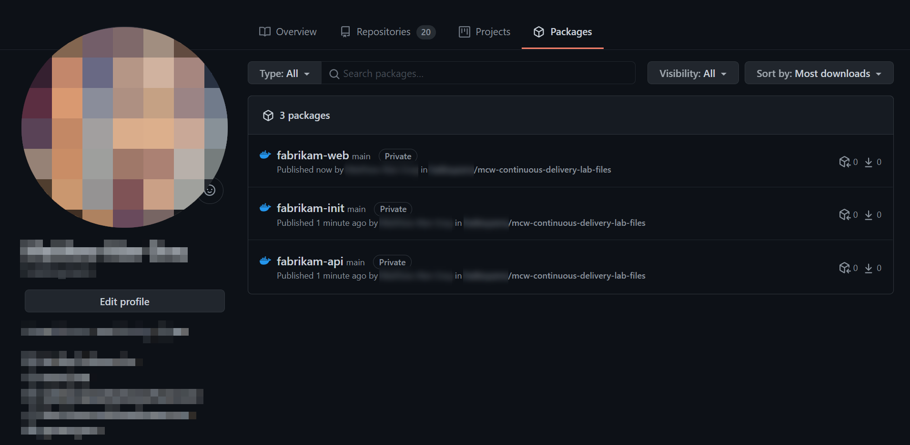

### Task 4: Using Dependabot

Another part of continuous integration is having a bot help track versions of the packages used in the application and notify us when there are newer versions. In this task, we will use Dependabot to track the versions of the packages we use in our GitHub repository and create pull requests to update packages for us.

1. In your lab files GitHub repository, navigate to the `Security` tab. Select the `Enable Dependabot alerts` button.

    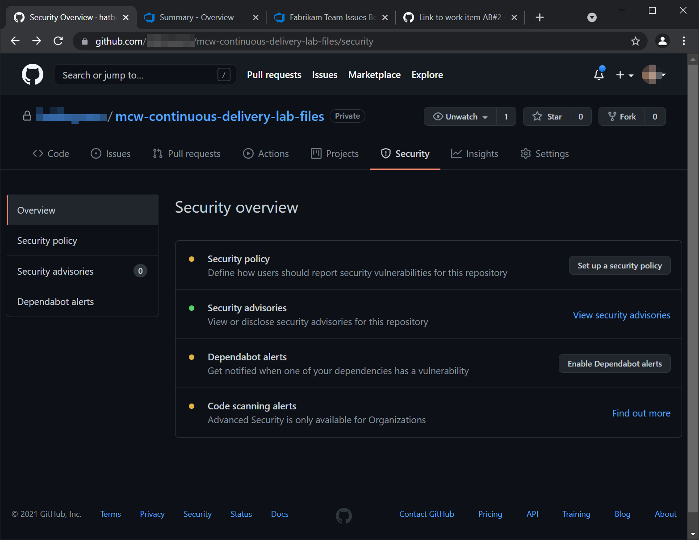

2. You should arrive at the `Security & analysis` blade under the `Settings` tab. Enable `Dependabot security updates`.

    > **Note**: Enabling the `Dependabot security updates` will also automatically enable `Dependency graph` and `Dependabot alerts`.

    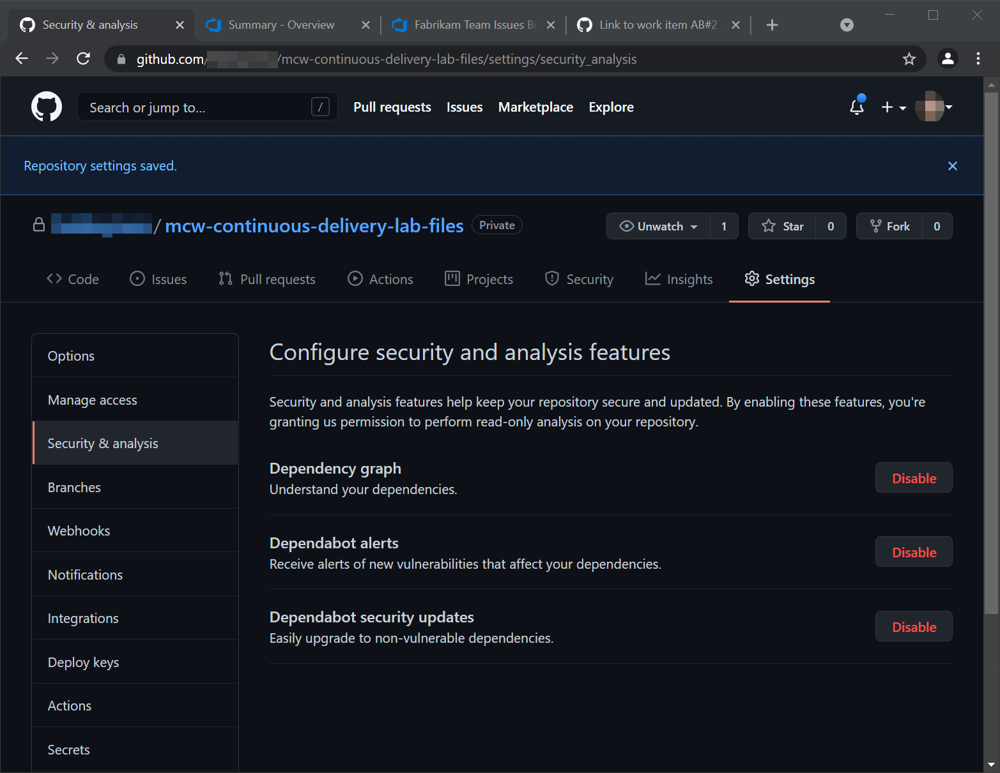

    > **Note**: The alerts for the repository may take some time to appear. The rest of the steps for this task rely on the alerts to be present.

3. To observe Dependabot issues, navigate to the `Security` tab and select the `View Dependabot alerts` link. You should arrive at the `Dependabot alerts` blade in the `Security` tab.

    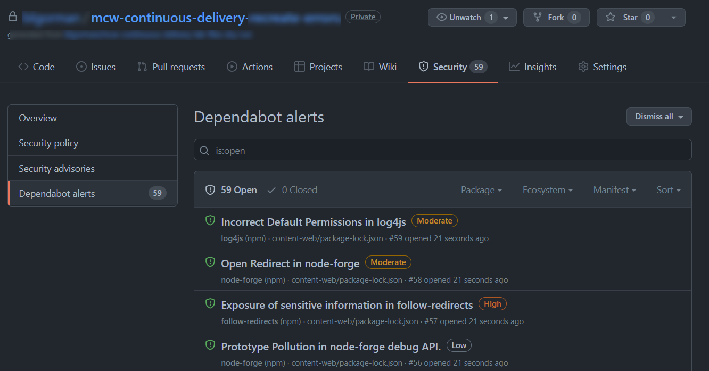

4. Sort the Dependabot alerts by `Package name`. Locate the `handlebars` vulnerability by typing `handlebars` in the search box under the `Package` dropdown menu.

    

5. Select any of the `handlebars` Dependabot alert entries to see the alert detail. After reviewing the alert, select `Create Dependabot security update` and wait a few moments for GitHub to create the security update.

    

    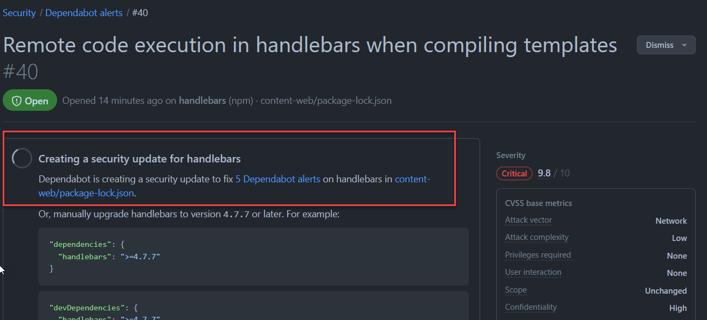

6. In the `Pull Requests` tab, find the Dependabot security patch pull request and merge it to your main branch.

    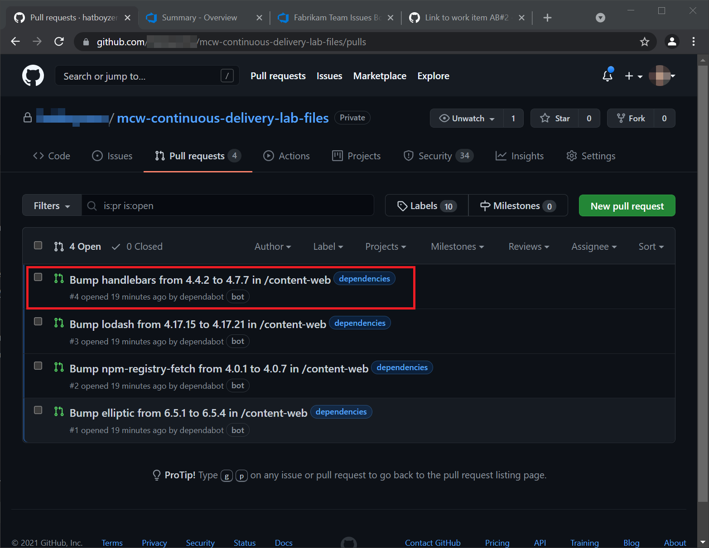

    

7. Pull the latest changes from your GitHub repository to your local GitHub folder.

    ```pwsh
    cd C:\Workspaces\lab\mcw-continuous-delivery-lab-files  # This path may vary depending on how
                                                            # you set up your lab files repository
    git pull
    ```

## Exercise 2: Continuous Delivery / Continuous Deployment

Duration: 40 minutes

The Fabrikam Medical Conferences developer workflow has been improved. We are ready to consider migrating from running on-premises to a cloud implementation to reduce maintenance costs and facilitate scaling when necessary. We will take steps to run the containerized application in the cloud as well as automate its deployment.

**Help references**

|                                       |                                                                        |
| ------------------------------------- | ---------------------------------------------------------------------- |
| **Description**                       | **Link**                                                              |
| What is Continuous Delivery? | <https://docs.microsoft.com/devops/deliver/what-is-continuous-delivery> |
| Continuous delivery vs. continuous deployment | <https://azure.microsoft.com/overview/continuous-delivery-vs-continuous-deployment/> |
| Microsoft Learn - Introduction to continuous delivery | <https://docs.microsoft.com/learn/modules/introduction-to-continuous-delivery> |
| Microsoft Learn - Explain DevOps Continuous Delivery and Continuous Quality | <https://docs.microsoft.com/learn/modules/explain-devops-continous-delivery-quality/> |

### Task 1: Set up Cloud Infrastructure

First, we need to set up the cloud infrastructure. We will use PowerShell scripts and the Azure Command Line Interface (CLI) to set this up.

1. Open your local GitHub folder for your `mcw-continuous-delivery-lab-files` repository.

2. Open the `deploy-infrastructure.ps1` PowerShell script in the `infrastructure` folder. Add a custom lowercase three-letter abbreviation for the `$studentprefix` variable on the first line.

    ```pwsh
    $studentprefix = "Your 3 letter abbreviation here"  # <-- Modify this value
    $resourcegroupName = "fabmedical-rg-" + $studentprefix
    $cosmosDBName = "fabmedical-cdb-" + $studentprefix
    $webappName = "fabmedical-web-" + $studentprefix
    $planName = "fabmedical-plan-" + $studentprefix
    $location1 = "westeurope"
    $location2 = "northeurope"
    ```

3. Note the individual calls to the Azure CLI for the following:
    - Creating a Resource Group

        ```pwsh
        # Create resource group
        az group create `
            --location $location1 `
            --name $resourcegroupName
        ```

    - Creating an Azure Cosmos DB Database

        ```pwsh
        # Create Azure Cosmos DB database
        az cosmosdb create `
            --name $cosmosDBName `
            --resource-group $resourcegroupName `
            --locations regionName=$location1 failoverPriority=0 isZoneRedundant=False `
            --locations regionName=$location2 failoverPriority=1 isZoneRedundant=True `
            --enable-multiple-write-locations `
            --kind MongoDB
        ```

    - Creating an Azure App Service Plan

        ```pwsh
        # Create Azure App Service Plan
        az appservice plan create `
            --name $planName `
            --resource-group $resourcegroupName `
            --sku S1 `
            --is-linux
        ```

    - Creating an Azure Web App

        ```pwsh
        # Create Azure Web App with NGINX container
        az webapp create `
            --resource-group $resourcegroupName `
            --plan $planName `
            --name $webappName `
            --deployment-container-image-name nginx
        ```

4. Log into Azure using the Azure CLI.

    ```pwsh
    az login
    az account set --subscription <your subscription guid>
    ```

    **Note**: Your subscription plan guid is the `id` field that comes back in the response JSON. In the following example, the subscription guid is `726da029-91f0-4dc1-a728-f25664374559`.

    ```json
      {
    "cloudName": "AzureCloud",
    "homeTenantId": "8f4781a5-82b9-4181-a022-4e9e91028be4",
    "id": "726da029-91f0-4dc1-a728-f25664374559",
    "isDefault": true,
    "managedByTenants": [],
    "name": "Your Azure Subscription Name",
    "state": "Enabled",
    "tenantId": "8f4781a5-82b9-4181-a022-4e9e91028be4",
    "user": {
      "name": "your-name@your-domain.com",
      "type": "user"
    }
    ```

5. Run the `deploy-infrastructure.ps1` PowerShell script.

    ```pwsh
    cd ./infrastructure
    ./deploy-infrastructure.ps1
    ```

    >**Note**: Depending on your system, you may need to change the PowerShell Execution Policy. You can read more about this process [here.](https://docs.microsoft.com/powershell/module/microsoft.powershell.core/about/about_execution_policies)

6. Browse to [the Azure portal](https://portal.azure.com) and verify creation of the resource group, Azure Cosmos DB instance, the App Service Plan, and the Web App.

    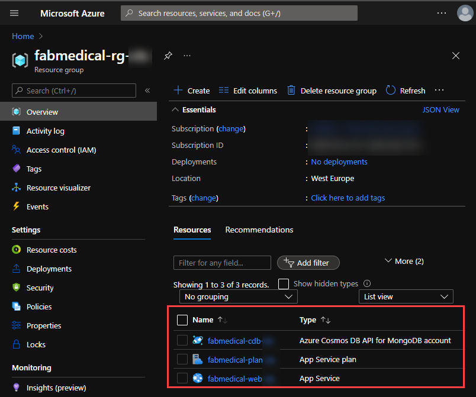

7. Open the `seed-cosmosdb.ps1` PowerShell script in the `infrastructure` folder of your lab files GitHub repository and add the same custom lowercase three-letter abbreviation we used in step 2 for the `$studentprefix` variable on the first line. Also update the `$githubAccount` variable with your GitHub account name.

    ```pwsh
    $studentprefix = "Your 3 letter abbreviation here"
    $githubAccount = "Your github account name here"
    $resourcegroupName = "fabmedical-rg-" + $studentprefix
    $cosmosDBName = "fabmedical-cdb-" + $studentprefix
    ```

8. Observe the call to fetch the MongoDB connection string for the Azure Cosmos DB database.

    ```pwsh
    # Fetch Azure Cosmos DB Mongo connection string
    $mongodbConnectionString = `
        $(az cosmosdb keys list `
            --name $cosmosDBName `
            --resource-group $resourcegroupName `
            --type connection-strings `
            --query 'connectionStrings[0].connectionString')
    ```

9. The call to seed the Azure Cosmos DB database is using the MongoDB connection string passed as an environment variable (`MONGODB_CONNECTION`) to the `fabrikam-init` docker image we built in the previous exercise using `docker-compose`.

    ```pwsh
    # Seed Azure Cosmos DB database
    docker run -ti `
        -e MONGODB_CONNECTION="$mongodbConnectionString" `
        ghcr.io/$githubAccount/fabrikam-init:main
    ```

    >**Note**: Before you pull this image, you may need to authenticate with the GitHub Docker registry. To do this, run the following command before you execute the script. Fill the placeholder appropriately. Use your PAT when it prompts for the password.

    ```pwsh
    docker login ghcr.io -u [USERNAME]
    ```

10. Run the `seed-cosmosdb.ps1` PowerShell script. Browse to [the Azure portal](https://portal.azure.com) and verify that the Azure Cosmos DB instance has been seeded.

    

     >**Note**: If the `seed-cosmosdb.ps1` script cannot find the `fabrikam-init` image, you may need to check the possible versions by looking at the `fabrikam-init` package page in your `mcw-continuous-delivery-lab-files` repository in GitHub.

    

11. Below the `sessions` collection, select **Scale & Settings** (1) and **Indexing Policy** (2).

    

12. Create a Single Field indexing policy for the `startTime` field (1). Then, select **Save** (2).

    

13. Open the `configure-webapp.ps1` PowerShell script in the `infrastructure` folder of your lab files GitHub repository and add the custom lowercase three-letter abbreviation you have been using for the `$studentprefix` variable on the first line.

    ```pwsh
    $studentprefix = "Your 3 letter abbreviation here"
    $resourcegroupName = "fabmedical-rg-" + $studentprefix
    $cosmosDBName = "fabmedical-cdb-" + $studentprefix
    $webappName = "fabmedical-web-" + $studentprefix
    ```

14. Observe the call to configure the Azure Web App using the MongoDB connection string passed as an environment variable (`MONGODB_CONNECTION`) to the web application.

    ```pwsh
    # Configure Web App
    az webapp config appsettings set `
        --name $webappName `
        --resource-group $resourcegroupName `
        --settings MONGODB_CONNECTION=$mongodbConnectionString
    ```

15. Run the `configure-webapp.ps1` PowerShell script. Browse to [the Azure portal](https://portal.azure.com) and verify that the environment variable `MONGODB_CONNECTION` has been added to the Azure Web Application settings.

    

### Task 2: Deploy to Azure Web Application

Once the infrastructure is in place, then we can deploy the code to Azure. In this task, you will deploy the application to an Azure Web Application using a PowerShell script that makes calls with the Azure CLI.

1. Take the GitHub Personal Access Token you obtained in the Before the Hands-On Lab guided instruction and assign it to the `CR_PAT` environment variable in PowerShell. We will need this environment variable for the `deploy-webapp.ps1` PowerShell script, but we do not want to add it to any files that may get committed to the repository since it is a secret value.

    ```pwsh
    $env:CR_PAT="<GitHub Personal Access Token>"
    ```

2. Open the `deploy-webapp.ps1` PowerShell script in the `infrastructure` folder of your lab files GitHub repository and add the same custom lowercase three-letter abbreviation we used in step 1 for the `$studentprefix` variable on the first line and add your GitHub account name for the `$githubAccount` variable on the second line.

    ```pwsh
    $studentprefix = "Your 3 letter abbreviation here"
    $githubAccount = "Your github account name here"
    $resourcegroupName = "fabmedical-rg-" + $studentprefix
    $webappName = "fabmedical-web-" + $studentprefix
    ```

3. The call to deploy the Azure Web Application is using the `docker-compose.yml` file we modified in the previous exercise.

    ```pwsh
    # Deploy Azure Web App
    az webapp config container set `
        --docker-registry-server-password $env:CR_PAT `
        --docker-registry-server-url https://ghcr.io `
        --docker-registry-server-user $githubAccount `
        --multicontainer-config-file ./../docker-compose.yml `
        --multicontainer-config-type COMPOSE `
        --name $webappName `
        --resource-group $resourcegroupName
    ```

4. Run the `deploy-webapp.ps1` PowerShell script.

    > **Note**: Make sure to run the `deploy-webapp.ps1` script from the `infrastructure` folder

5. Browse to [the Azure portal](https://portal.azure.com) and verify that the Azure Web Application is running by checking the `Log stream` blade of the Azure Web Application detail page.

    

6. Browse to the `Overview` blade of the Azure Web Application detail page and find the web application URL. Browse to that URL to verify the deployment of the web application.

    

    

### Task 3: Continuous Deployment with GitHub Actions

With the infrastructure in place, we can set up continuous deployment with GitHub Actions.

1. Open the `deploy-sp.ps1` PowerShell script in the `infrastructure` folder of your lab files GitHub repository and add the same custom lowercase three-letter abbreviation we used in a previous exercise for `$studentprefix` variable on the first line. Note the call to create a Service Principal.

    ```pwsh
    $studentprefix ="Your 3 letter abbreviation here"
    $resourcegroupName = "fabmedical-rg-" + $studentprefix

    $id = $(az group show `
        --name $resourcegroupName `
        --query id)

    az ad sp create-for-rbac `
        --name "fabmedical-$studentprefix" `
        --sdk-auth `
        --role contributor `
        --scopes $id
    ```

2. Execute the `deploy-sp.ps1` PowerShell script. Copy the resulting JSON output for use in the next step.

    ```pwsh
    {
        "clientId": "...",
        "clientSecret": "...",
        "subscriptionId": "...",
        "tenantId": "...",
        "activeDirectoryEndpointUrl": "https://login.microsoftonline.com",
        "resourceManagerEndpointUrl": "https://management.azure.com/",
        "activeDirectoryGraphResourceId": "https://graph.windows.net/",
        "sqlManagementEndpointUrl": "https://management.core.windows.net:8443/",
        "galleryEndpointUrl": "https://gallery.azure.com/",
        "managementEndpointUrl": "https://management.core.windows.net/"
    }
    ```

3. Create a new repository secret named `AZURE_CREDENTIALS`. Paste the JSON output copied from Step 2 to the secret value and save it.

4. Edit the `docker-publish.yml` file in the `.github\workflows` folder. Add the following job to the end of this file:

    > **Note**: Make sure to change the student prefix for the last action in the `deploy` job.

    ```yaml
      deploy:
        # The type of runner that the job will run on
        runs-on: ubuntu-latest

        # Steps represent a sequence of tasks that will be executed as part of the job
        steps:
        # Checks-out your repository under $GITHUB_WORKSPACE, so your job can access it
        - uses: actions/checkout@v2                

        - name: Login on Azure CLI
          uses: azure/login@v1.1
          with:
            creds: ${{ secrets.AZURE_CREDENTIALS }}

        - name: Deploy WebApp
          shell: pwsh
          env:
            CR_PAT: ${{ secrets.CR_PAT }}
          run: |
            cd ./infrastructure
            ./deploy-webapp.ps1 -studentprefix hbs  # <-- This needs to
                                                    # match the student
                                                    # prefix we use in
                                                    # previous steps.
    ```

5. Commit the YAML file to your `main` branch. A GitHub action should begin to execute for the updated workflow.

    > **Note**: Make sure that your Actions workflow file does not contain any syntax errors, which may appear when you copy and paste. They are highlighted in the editor or when the Action tries to run, as shown below.

    

6. Observe that the action builds the docker images, pushes them to the container registry, and deploys them to the Azure web application.

    

7. Perform a `git pull` on your local repository folder to fetch the latest changes from GitHub.

### Task 4: Branch Policies in GitHub (Optional)

In many enterprises, committing to `main` is restricted. Branch policies are used to control how code gets to `main`. This allows you to set up gates on delivery, such as requiring code reviews and status checks. In this task, you will create a branch protection rule and see it in action.

>**Note**: Branch protection rules apply to Pro, Team, and Enterprise GitHub users.

1. In your lab files GitHub repository, navigate to the `Settings` tab and select the `Branches` blade.

    

2. Select the `Add rule` button to add a new branch protection rule for the `main` branch. Be sure to specify `main` in the branch name pattern field. Enable the following options and choose the `Create` button to create the branch protection rules:

   - Require pull request reviews before merging
   - Require status checks to pass before merging
   - Require branches to be up to date before merging

    

3. With the branch protection rule in place, direct commits and pushes to the `main` branch will be disabled. Verify this rule by making a small change to your README.md file. Attempt to commit the change to the `main` branch in your local repository followed by a push to the remote repository.

    ```pwsh
    PS C:\Workspaces\lab\mcw-continuous-delivery-lab-files> git add .

    PS C:\Workspaces\lab\mcw-continuous-delivery-lab-files> git commit -m "Updating README.md"

    [main cafa839] Updating README.md
    1 file changed, 2 insertions(+)
    PS C:\Workspaces\lab\mcw-continuous-delivery-lab-files> git push

    Enumerating objects: 5, done.
    Counting objects: 100% (5/5), done.
    Delta compression using up to 32 threads
    Compressing objects: 100% (3/3), done.
    Writing objects: 100% (3/3), 315 bytes | 315.00 KiB/s, done.
    Total 3 (delta 2), reused 0 (delta 0), pack-reused 0
    remote: Resolving deltas: 100% (2/2), completed with 2 local objects.
    remote: error: GH006: Protected branch update failed for refs/heads/main.
    remote: error: At least 1 approving review is required by reviewers with write access.
    To https://github.com/YOUR_GITHUB_ACCOUNT/mcw-continuous-delivery-lab-files.git
    ! [remote rejected] main -> main (protected branch hook declined)
    error: failed to push some refs to 'https://github.com/YOUR_GITHUB_ACCOUNT/mcw-continuous-delivery-lab-files.git'
    ```

## Exercise 3: Monitoring, Logging, and Continuous Deployment with Azure

Duration: 40 minutes

Fabrikam Medical Conferences has its first website for a customer running in the cloud, but deployment is still a largely manual process, and we have no insight into the behavior of the application in the cloud. In this exercise, we will add monitoring and logging to gain insight on the application usage in the cloud. Then, we will disable the GitHub pipeline and show how to build a deployment pipeline in Azure DevOps.

### Task 1: Set up Application Insights

In this task, we will set up Application Insights to gain some insights on how our site is being used and assist in debugging if we run into issues.

1. Open the `deploy-appinsights.ps1` PowerShell script in the `infrastructure` folder of your lab files GitHub repository and add the same custom lowercase three-letter abbreviation we used in step 1 for the `$studentsuffix` variable on the first line.

    ```pwsh
    $studentsuffix = "Your 3 letter abbreviation here"
    $resourcegroupName = "fabmedical-rg-" + $studentsuffix
    $location1 = "westeurope"
    $appInsights = "fabmedicalai-" + $studentsuffix
    ```

2. Run the `deploy-appinsights.ps1` PowerShell script from a PowerShell terminal and save the `AI Instrumentation Key` specified in the output - we will need it for a later step.

    ```bash
    The installed extension 'application-insights' is in preview.
    AI Instrumentation Key="55cade0c-197e-4489-961c-51e2e6423ea2"
    ```

3. Navigate to the `./content-web` folder in your GitHub lab files repository and execute the following to install JavaScript support for Application Insights via NPM to the web application frontend.

    ```bash
    npm install applicationinsights --save
    ```

4. Modify the file `./content-web/app.js` to reflect the following to add and configure Application Insights for the web application frontend.

    ```js
    const express = require('express');
    const http = require('http');
    const path = require('path');
    const request = require('request');

    const app = express();

    const appInsights = require("applicationinsights");         # <-- Add these lines here
    appInsights.setup("55cade0c-197e-4489-961c-51e2e6423ea2");  # <-- Make sure AI Inst. Key matches
    appInsights.start();                                        # <-- key from step 2.

    app.use(express.static(path.join(__dirname, 'dist/content-web')));
    const contentApiUrl = process.env.CONTENT_API_URL || "http://localhost:3001";
    ```

5. Add and commit changes to your GitHub lab-files repository. From the root of the repository, execute the following:

    ```pwsh
    git add .
    git commit -m "Added Application Insights"
    git push
    ```

6. Wait for the GitHub Actions for your lab files repository to complete before executing the next step.

7. Redeploy the web application by running the `deploy-webapp.ps1` PowerShell script from the `infrastructure` folder.

8. Visit the deployed website and check Application Insights in [the Azure portal](https://portal.azure.com) to see instrumentation data.

### Task 2: Linking Git commits to Azure DevOps issues

In this task, you will create an issue in Azure DevOps and link a Git pull request from GitHub to the Azure DevOps issue. This uses the Azure Boards integration that was set up in the Before Hands on Lab.

1. Create a new issue for modifying the README.md in Azure Boards

    

    > **Note**: Make note of the issue number, as you will need it for a later step.

2. Create a branch from `main` and name it `feature/update-readme`.

    ```pwsh
    git checkout main
    git checkout -b feature/update-readme  # <- This creates the branch and checks it out    
    ```    

3. Make a small change to README.md. Commit the change, and push it to GitHub.

    ```pwsh
    git commit -m "README.md update"
    git push --set-upstream origin feature/update-readme
    ```

4. Create a pull request to merge `feature/update-readme` into `main` in GitHub. Add the annotation `AB#YOUR_ISSUE_NUMBER_FROM_STEP_4` in the description of the pull request to link the GitHub pull request with the new Azure Boards issue in step 4. For example, if your issue number is 2, then your annotation in the pull request description should include `AB#2`.

    > **Note**: The `Docker` build workflow executes as part of the status checks.

5. Select the `Merge pull request` button after the build completes successfully to merge the Pull Request into `main`.

    

    > **Note**: Under normal circumstances, this pull request would be reviewed by someone other than the author of the pull request. For now, use your administrator privileges to force the merge of the pull request.

6. Observe in Azure Boards that the Issue is appropriately linked to the GitHub comment.

    

### Task 3: Continuous Deployment with Azure DevOps Pipelines

> **Note**: This section demonstrates Continuous Deployment via ADO pipelines, which is equivalent to the Continuous Deployment via GitHub Actions demonstrated in Task 2. For this reason, disabling GitHub action here is critical so that both pipelines (ADO & GitHub Actions) don't interfere with each other.
> **Note**: To complete [Exercise 3: Task 3](#task-3-continuous-deployment-with-azure-devops-pipelines), the student will need to request a free grant of parallel jobs in Azure Pipelines via [this form](https://aka.ms/azpipelines-parallelism-request). More information can be found [here regarding changes in Azure Pipelines Grant for Public Projects](https://devblogs.microsoft.com/devops/change-in-azure-pipelines-grant-for-public-projects/)

1. Disable your GitHub Actions by adding the `branches-ignore` property to the existing workflows in your lab files repository (located under the `.github/workflows` folder).

    ```pwsh
    on:
      push:
        branches-ignore:    # <-- Add this list property
          - '**'            # <-- with '**' to disable all branches
    ```

2. Navigate to your Azure DevOps `Fabrikam` project, select the `Project Settings` blade, and open the `Service Connections` tab.

3. Create a new `Docker Registry` service connection and set the values to:

    - Docker Registry: <https://ghcr.io>
    - Docker ID: [GitHub account name]
    - Docker Password: [GitHub Personal Access Token]
    - Service connection name: GitHub Container Registry

    

4. Navigate to your Azure DevOps `Fabrikam` project, select the `Pipelines` blade, and create a new pipeline.

    

5. In the `Connect` tab, choose the `GitHub` selection.

    

6. Select your GitHub lab files repository. Azure DevOps will redirect you to authorize yourself with GitHub. Log in and select the repository that you want to allow Azure DevOps to access.

7. In the `Configure` tab, choose the `Starter Pipeline`.

    

8. Remove all the steps from the YAML. The empty pipeline should look like the following:

    ```yaml
    # Starter pipeline
    # Start with a minimal pipeline that you can customize to build and deploy your code.
    # Add steps that build, run tests, deploy, and more:
    # https://aka.ms/yaml

    trigger:
    - main

    pool:
      vmImage: ubuntu-latest

    steps:
    ```

9. In the sidebar, find the `Docker Compose` task and configure it with the following fields, then select the **Add** button:

    - Container Registry Type: Container Registry
    - Docker Registry Service Connection: GitHub Container Registry (created in step 3)
    - Docker Compose File: **/docker-compose.yml
    - Additional Docker Compose Files: build.docker-compose.yml
    - Action: Build Service Images
    - Additional Image Tags = $(Build.BuildNumber)

    
    

    >**Note**: If the sidebar doesn't appear, you may need to select `Show assistant`.

10. Repeat step 9 and add another `Docker Compose` task and configure it with the following fields:

    - Container Registry Type: Container Registry
    - Docker Registry Service Connection: GitHub Container Registry (created in step 3)
    - Docker Compose File: **/docker-compose.yml
    - Additional Docker Compose Files: build.docker-compose.yml
    - Action: Push Service Images
    - Additional Image Tags = $(Build.BuildNumber)

    >**Note**: Pay close attention to the **Action** in Step 10. This is where it differs from Step 9.

    The YAML should be:

    ```yaml
    # Starter pipeline
    # Start with a minimal pipeline that you can customize to build and deploy your code.
    # Add steps that build, run tests, deploy, and more:
    # https://aka.ms/yaml

    trigger:
    - main

    pool:
    vmImage: ubuntu-latest

    steps:
    - task: DockerCompose@0
    inputs:
        containerregistrytype: 'Container Registry'
        dockerRegistryEndpoint: 'GitHub Container Registry'
        dockerComposeFile: '**/docker-compose.yml'
        additionalDockerComposeFiles: 'build.docker-compose.yml'
        action: 'Push services'
        additionalImageTags: '$(Build.BuildNumber)'
    - task: DockerCompose@0
    inputs:
        containerregistrytype: 'Container Registry'
        dockerRegistryEndpoint: 'GitHub Container Registry'
        dockerComposeFile: '**/docker-compose.yml'
        additionalDockerComposeFiles: 'build.docker-compose.yml'
        action: 'Push services'
        additionalImageTags: '$(Build.BuildNumber)'
    ```

11. Save and run the build. New docker images will be built and pushed to the GitHub package registry.

    >**Note**: You may need to grant permission for the pipeline to use the service connection before the run happens.

    

    If you haven't been granted the parallelism, your job will fail with the following message:

    ```text
    ##[error]No hosted parallelism has been purchased or granted. To request a free parallelism grant, please fill out the following form https://aka.ms/azpipelines-parallelism-request
    ```

    Once parallelism is granted, then your pipeline can run.

12. Navigate to your `Fabrikam` project in Azure DevOps and select the `Project Settings` blade. From there, select the `Service Connections` tab.

13. Create a new `Azure Resource Manager` service connection and choose `Service Principal (automatic)`.

14. Choose your target subscription and resource group and set the `Service Connection` name to `Fabrikam-Azure`. Save the service connection - we will reference it in a later step.

15. Open the build pipeline in `Edit` mode, and then select the `Variables` button on the top-right corner of the pipeline editor. Add a secret variable `CR_PAT`, check the `Keep this value secret` checkbox, and copy the GitHub Personal Access Token from the Before the Hands-on lab guided instruction into the `Value` field. Save the pipeline variable - we will reference it in a later step.

    

16. Modify the build pipeline YAML to split into a build stage and a deploy stage, as follows.

    >**Note**: Pay close attention to the `DeployProd` stage, as you need to add your abbreviation to the `arguments` section.

    ```yaml
    # Starter pipeline
    # Start with a minimal pipeline that you can customize to build and deploy your code.
    # Add steps that build, run tests, deploy, and more:
    # https://aka.ms/yaml

    trigger:
    - main

    pool:
      vmImage: ubuntu-latest

    stages:
    - stage: build
      jobs:
      - job: 'BuildAndPublish'
        displayName: 'Build and Publish'
        steps:
        - task: DockerCompose@0
          inputs:
            containerregistrytype: 'Container Registry'
            dockerRegistryEndpoint: 'GitHub Container Registry'
            dockerComposeFile: '**/docker-compose.yml'
            additionalDockerComposeFiles: 'build.docker-compose.yml'
            action: 'Build services'
            additionalImageTags: '$(Build.BuildNumber)'
        - task: DockerCompose@0
          inputs:
            containerregistrytype: 'Container Registry'
            dockerRegistryEndpoint: 'GitHub Container Registry'
            dockerComposeFile: '**/docker-compose.yml'
            additionalDockerComposeFiles: 'build.docker-compose.yml'
            action: 'Push services'
            additionalImageTags: '$(Build.BuildNumber)'

    - stage: DeployProd
      dependsOn: build
      jobs:
      - deployment: webapp
        environment: production
        strategy:
          runOnce:
            deploy:
              steps:
              - checkout: self

              - powershell: |
                  (gc .\docker-compose.yml) `
                    -replace ':latest',':$(Build.BuildNumber)' | `
                    set-content .\docker-compose.yml
                    
              - task: AzureCLI@2
                inputs:
                  azureSubscription: 'Fabrikam-Azure' # <-- The service
                  scriptType: 'pscore'                # connection from step 14
                  scriptLocation: 'scriptPath'
                  scriptPath: './infrastructure/deploy-webapp.ps1'
                  workingDirectory: ./infrastructure
                  arguments: 'Your 3 letter abbreviation here'         # <-- This should be your custom
                env:                       # lowercase three character 
                  CR_PAT: $(CR_PAT)  # prefix from an earlier exercise.
                                # ^^^^^^
                                # ||||||
                                # The pipeline variable from step 15
    ```

17. Navigate to the `Environments` category with the `Pipelines` blade in the `Fabrikam` project and select the `production` environment.

    

18. From the vertical ellipsis menu button in the top-right corner, select `Approvals and checks`.

    

19. Add an `Approvals` check. Add your account as an `Approver` and create the check.

    

20. Run the build pipeline and note how the pipeline waits before moving to the `DeployProd` stage. You will need to approve the request before the `DeployProd` stage runs.

    

## After the hands-on lab

Duration: 15 minutes

Now that the lab is complete, we need to tear down the Azure resources that we created.

### Task 1: Tear down Azure Resources

Now that the lab is done, we are done with our Azure resources. It is good practice to tear down the resources and avoid incurring costs for unnecessary resources.

1. Open the `teardown-infrastructure.ps1` PowerShell script in the `infrastructure` folder of your GitHub lab files repository and add the same custom lowercase three-letter abbreviation we used in a previous exercise for `$studentprefix` variable on the first line.

    ```pwsh
    $studentprefix ="Your 3 letter abbreviation here"
    $resourcegroupName = "fabmedical-rg-" + $studentprefix

    az ad sp delete --id "fabmedical-$studentprefix"
    az group delete --name $resourceGroupName
    ```

2. Execute the `teardown-infrastructure.ps1` PowerShell script to tear down the Azure resources for this lab.

You should follow all steps provided *after* attending the Hands-on lab.
